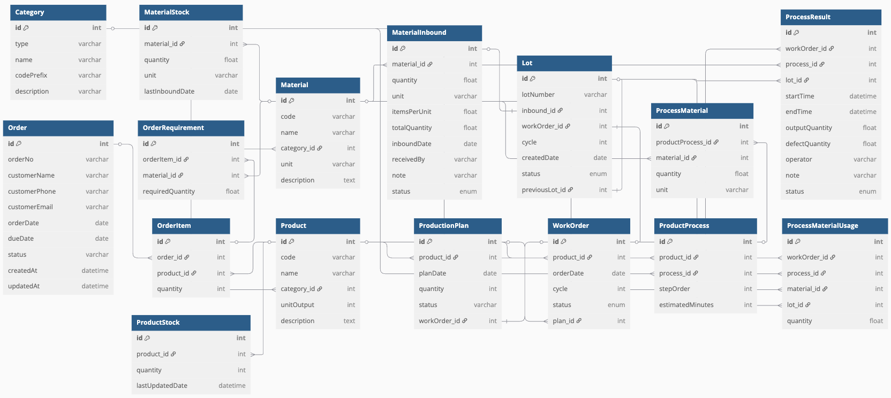
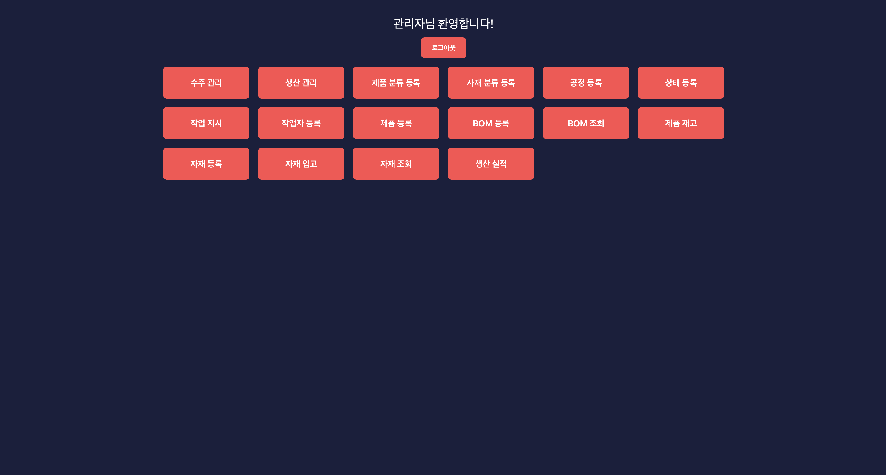
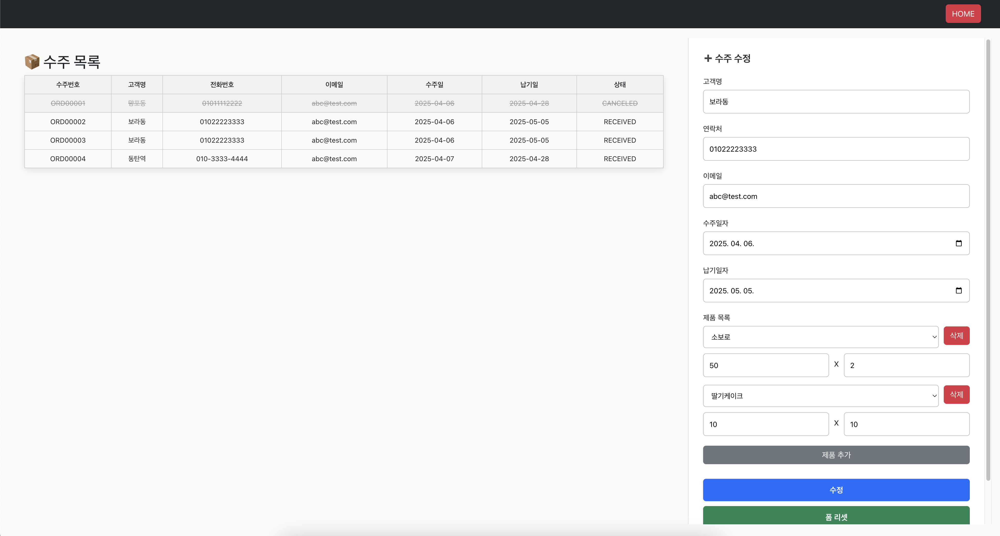
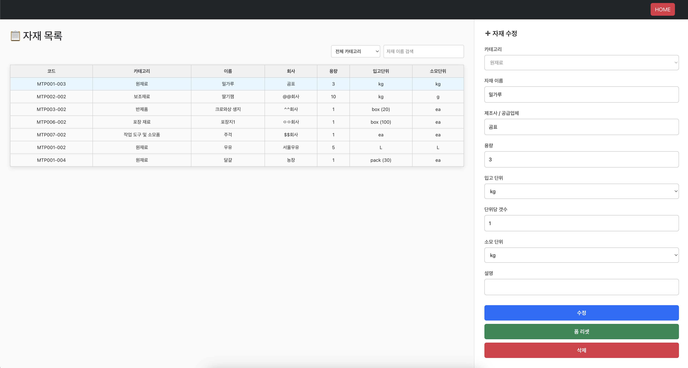
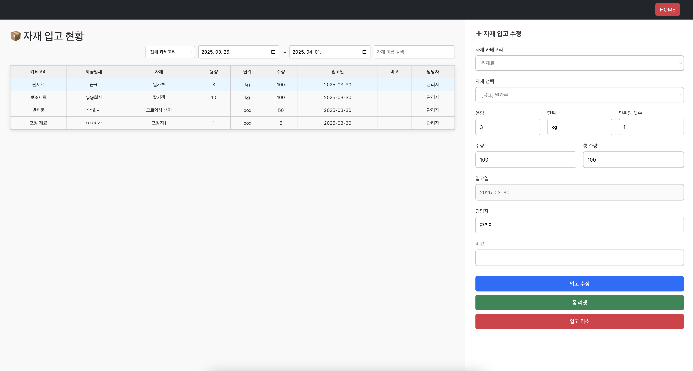
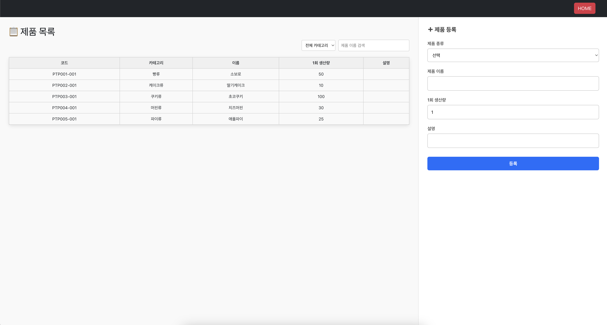
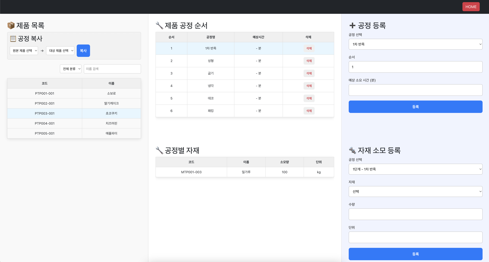
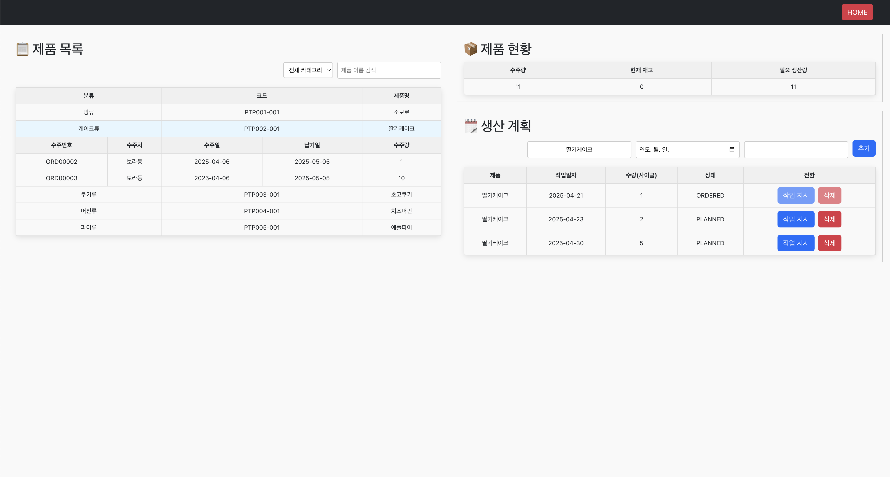
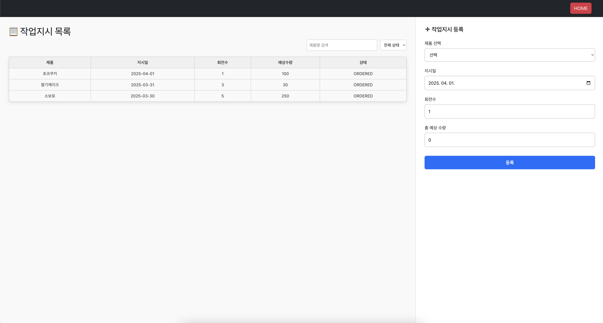
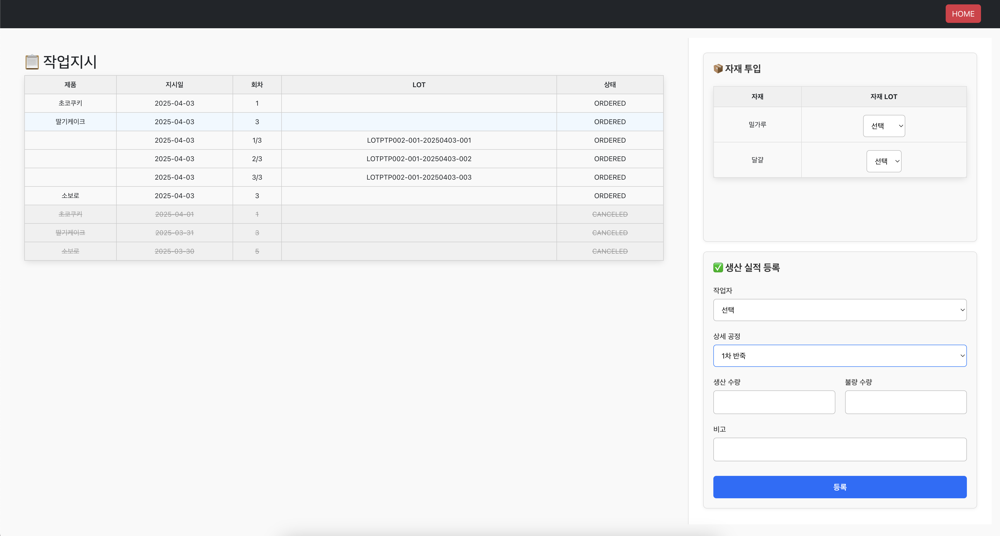

# 🍞 MES 시스템 (Spring Boot + React)

Spring Boot + React 기반의 생산관리 시스템으로, 
제품 등록부터 공정관리, 자재입고, 작업지시, LOT 추적 및 POP 실적 등록까지 일련의 생산 흐름을 관리할 수 있도록 구현한 시스템

## 📌 프로젝트 개요

- **프로젝트 유형:** 개인 프로젝트 (포트폴리오용)
- **개발 기간:** 2025.03 ~ (진행 중)
- **사용 기술:** Spring Boot, React, MySQL, JPA
- **기능 요약:** 제품/자재 등록, 작업지시 발행, LOT 추적, 자재 입고/재고 관리, 공정 실적 등록

---

## 🧱 ERD & 아키텍처

- 📌 주요 테이블

| 테이블명                   | 설명                     |
|------------------------|------------------------|
| `Category`             | 공정, 제품, 자재 등 공통 분류 테이블 |
| `Product`              | 제품 정보                  |
| `ProductProcess`       | 제품별 공정 정보 ( BOM 연동)    |
| `ProcessMaterial`      | 공정별 자재 소모 정보 ( BOM 연동) |
| `Material`             | 자재 정보                  |
| `MaterialInbound`      | 자재 입고 내역               |
| `MaterialStock`        | 자재 재고 정보               |
| `WorkOrder`            | 작업지시 정보                |
| `Lot`                  | LOT 정보 (제품/자재 모두 포함)   |
| `ProcessMaterialUsage` | 공정별 자재 사용 이력           |
| `ProcessResult`        | 공정별 생산 실적              |
| `ProductStock`         | 제품 재고 정보               |
| `Order`                | 수주 정보                  |
| `OrderItem`            | 수주별 제품 및 수량            |
| `OrderRequirement`     | 수주-제품 별 필요 자재량         |
| `ProductionPlan`       | 생산 계획                  |

- ⚙️ 아키텍처:
    - React (Frontend) ↔ Spring Boot (Backend) ↔ MySQL
    - RESTful API 구조

---

## ⚙️ 비즈니스 로직 설계 요약

| 기능             | 로직 설명                                       |
|----------------|---------------------------------------------|
| 수주 관리          | 수주별 제품 리스트로 연결                              |
| 생산 관리          | 제품별 생산 계획 등록 → 작업지시로 변환                     |
| 자재 입고          | 자재 선택 후 수량 입력 →  LOT 자동 생성 →  재고 수량 증가      |
| 작업지시           | 제품 + 사이클 수 입력 → 총 생산량 계산 → 작업지시 + LOT 자동 생성 |
| LOT 생성         | LOT 번호 자동 생성 후 DB 저장                        |
| 생산 실적 등록 (진행중) | 공정, LOT, 작업자, 시간, 생산/불량 수량 기록 → 실적 집계       |
| 출고 처리 (예정)     | 자재가 실제로 사용되었을 때 재고에서 출고로 전환 및 사용 LOT 기록     |
| 발주 관리 (예정)     |                                             |

---

## ✅ 핵심 기능

### 🔹 수주 관리

- 수주번호 자동 생성 (ORD0001 형식)
- 수주별 제품 목록 리스트로 연결

### 🔹 생산 관리

- 제품별 생산계획 수립 가능
- 제품별 재고, 수주량, 필요생산량 자동 계산
- 생산계획 자동 작업지시 전환기능

### 🔹 자재 등록/입고

- 자재코드 자동생성 (MTP001-001 형식)
- 자재 입고 시 재고 수량 자동 반영
- 입고일, 담당자 자동 입력

### 🔹 제품별 공정 등록 (BOM 연동)

- 제품마다 공정 순서를 등록 가능
- 기존 제품의 공정 정보를 복사하여 빠르게 등록 가능
- *~~드래그앤드랍 UI로 공정 순서 변경 (추가 예정)~~*

### 🔹 공정별 자재 소모 등록 (BOM 연동)

- 각 공정에 필요한 자재를 등록
- 소모 수량 입력 가능
- 등록된 자재는 생산 시 소모 내역으로 추적 가능

### 🔹 작업지시

- 제품 선택 + 사이클 수 입력
- unitOutput × cycle → 총 생산량 자동 계산

### 🔹 LOT 자동 생성

- 자재 입고시 LOT 번호 자동 생성
- 작업 사이클 수만큼 개별 LOT 번호 자동 생성 (예: LOT20240331-001 ~ 003)
- 제품, 작업지시와 매핑 저장

---

## 🔄 작업 예정 기능

### 🔹 생산 실적 등록

- 작업자가 공정 단위로 생산 실적을 등록
- 양품 수량, 불량 수량 입력
- 등록된 실적은 LOT 단위로 연결되어 저장
- 자재 투입

### 🔹 LOT 기반 생산 이력 추적

- 제품 LOT를 기준으로 어떤 공정이 수행되었는지 확인 가능
- 각 공정에서 어떤 자재 LOT가 사용되었는지도 기록 예정
- 추후 역추적(Traceability)을 위한 기반 구축

### 🔹 자재 출고 처리

- 생산 시 공정에 따라 자재 재고에서 출고 처리
- 사용된 자재는 LOT 단위로 기록되어 추적 가능
- 출고 수량은 공정별 소모량과 연동되어 자동 계산될 예정

---

## 🎞️ 화면 흐름
🔽 메인화면

🔽 수주 관리

🔽 자재 관리

🔽 자재 입고

- 자재 입고시 자동 LOT번호 생성

🔽 제품 등록

🔽 제품별 공정, 자재 소모량 등록 화면

- 공정 복사기능
- 제품 별 공정 등록 가능
- 공정 별 자재 등록 가능

🔽 생산 관리

- 제품별 재고, 수주량, 필요생산량 자동 계산
- 생산 계획 작업지시로 변경 가능
- 작업지시로 변환전인 계획단계에서만 취소 가능

🔽 작업지시 화면

- 작업 사이클당 LOT번호 자동 생성
- 작업지시 취소시 연결된 생산계획 있으면 반영

🔽 생산실적 등록 화면(진행중)

